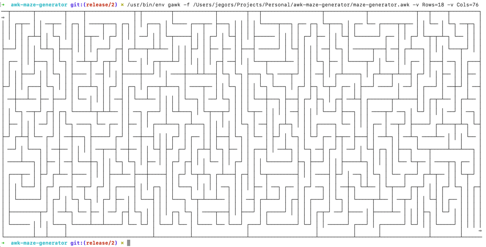

# The AWK scripts to generate maze

The repository contains two different implementations of maze generation scripts.

## How to run program

Every time you run the script, you will receive a random maze.

```shell
gawk -v Rows=8 -v Cols=36 -f maze-gen-one.awk
```

However, if you specify optional Seed variables, you will get the same maze every time you run the script with a specific Seed value.

```shell
gawk -v Rows=8 -v Cols=36 -v Seed=42 -f maze-gen-one.awk
```

## Sample output (picture)


