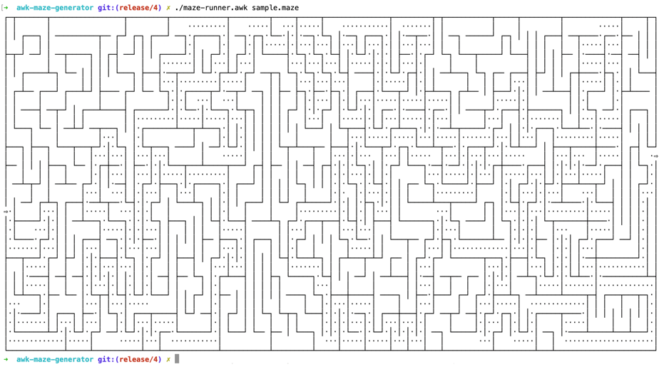

# The AWK scripts to generate maze

The repository contains AWK scripts to generate a random maze and find a path in the maze.

## Generate a random maze

To generate a maze, you can use one of two scripts: `maze-gen-one.awk` or `maze-gen-two.awk`. These two scripts work the same but use completely different algorithms to generate the maze. Both scripts have two mandatory parameters - the number of rows (Rows) and columns (Cols) in the maze. You can also specify an optional `Seed` parameter. 

Every time you run the script, you will receive a random maze.

```shell
gawk -f maze-gen-two.awk -v Rows=8 -v Cols=36 
```

However, if you specify optional `Seed` variables, you will get the same maze every time you run the script with a specific `Seed` value.

```shell
gawk -f maze-gen-two.awk -v Rows=8 -v Cols=36 -v Seed=42 
```

### Sample output 


### Make scripts executable 

You can set the execution flag for scripts.

```shell
chmod +x maze-gen-two.awk
```

This will allow you to run scripts directly without specifying an interpreter.

```shell
./maze-gen-two.awk -v Rows=8 -v Cols=36
```

### Save the maze

```shell
./maze-gen-two.awk -v Rows=8 -v Cols=36 Seed=42 > docs/sample.maze
```

## Test generated maze

You can run the test script to check the correctness of the maze generator.

```shell    
gawk -f maze-test.awk -v Rows=18 -v Cols=76 docs/sample.maze
```

## Find the path

```shell
gawk -f maze-runner.awk sample.maze
```

### Sample output of path



## ASCII version of maze generator

In case pseudographic characters are not supported on your computer, there is a version for generating a maze using only asc characters.

```shell
gawk -f maze-gen-asc.awk -v Rows=9 -v Cols=21
```
### Sample output

```text
➜  awk-maze-generator git:(release/5) ✗ gawk -f maze-gen-asc.awk -v Rows=9 -v Cols=21
######################################################################################
##          ##              ##          ##                          ##              ##
##  ######  ##  ##########  ######  ##  ##  ##############  ######  ##  ##  ######  ##
##  ##          ##      ##      ##  ##  ##      ##      ##      ##  ##  ##      ##  ##
##  ##  ##########  ##  ######  ######  ######  ##  ##########  ######  ######  ##  ##
##  ##  ##          ##  ##  ##      ##      ##  ##          ##          ##      ##  ##
##  ######  ##########  ##  ######  ##  ##  ##  ######  ##  ##############  ######  ##
##      ##  ##  ##      ##      ##  ##  ##  ##      ##  ##              ##      ##  ##
##  ##  ##  ##  ##  ######  ##  ##  ##  ##  ######  ##  ##############  ######  ##  ##
##  ##          ##  ##  ##  ##  ##  ##  ##      ##  ##          ##      ##      ##  ##
##  ##############  ##  ##  ##  ##  ##  ##########  ##############  ##  ##  ######  ##
##  ##              ##      ##          ##      ##      ##          ##  ##  ##  ##  ##
##  ##  ##  ##########  ##################  ##  ######  ##  ######  ######  ##  ##  ##
##  ##  ##  ##      ##  ##                  ##  ##      ##  ##      ##      ##        
##  ##  ######  ##  ######  ##################  ##  ######  ######  ##  ##############
    ##      ##  ##          ##      ##          ##      ##      ##  ##  ##          ##
##  ######  ##  ##############  ##  ##  ##############  ######  ##  ##  ##  ######  ##
##      ##                      ##  ##                          ##  ##          ##  ##
######################################################################################
➜  awk-maze-generator git:(release/5) ✗  
```
